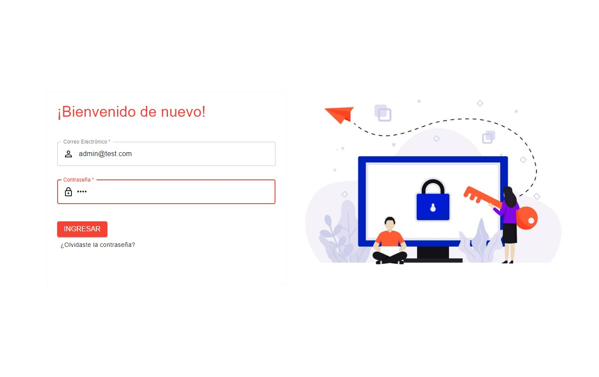
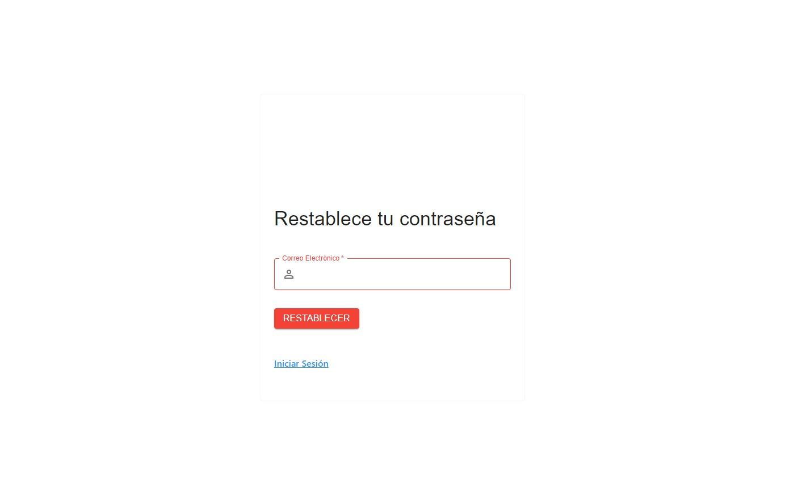
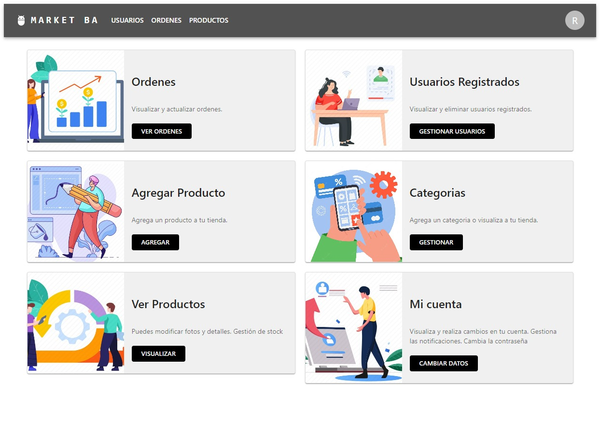
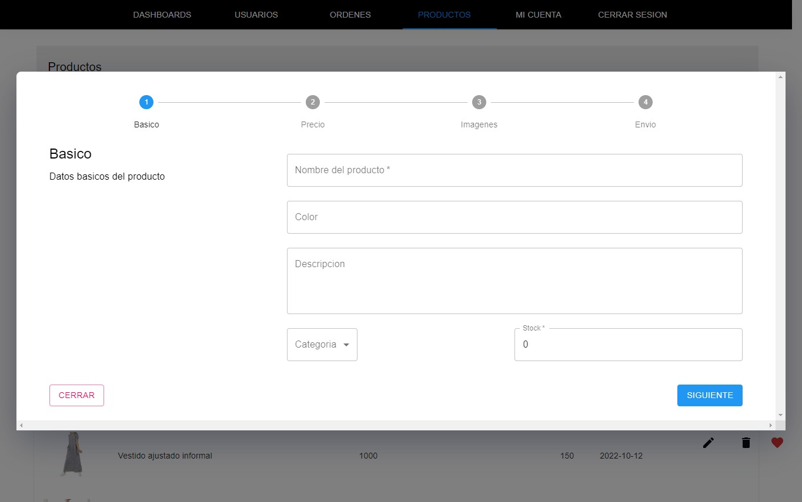
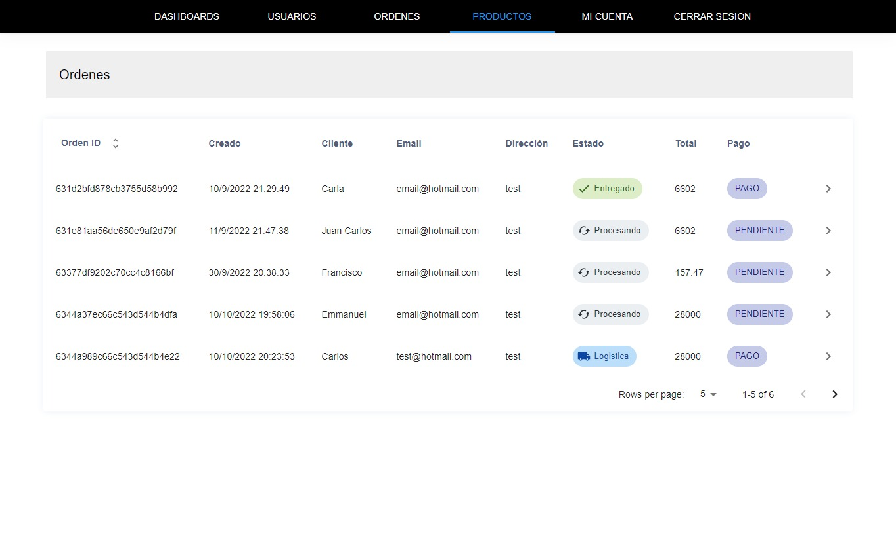
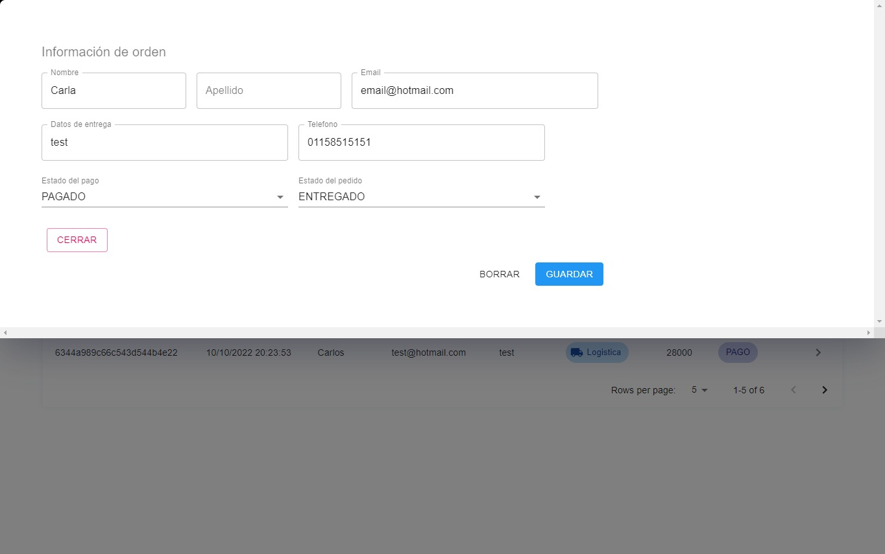
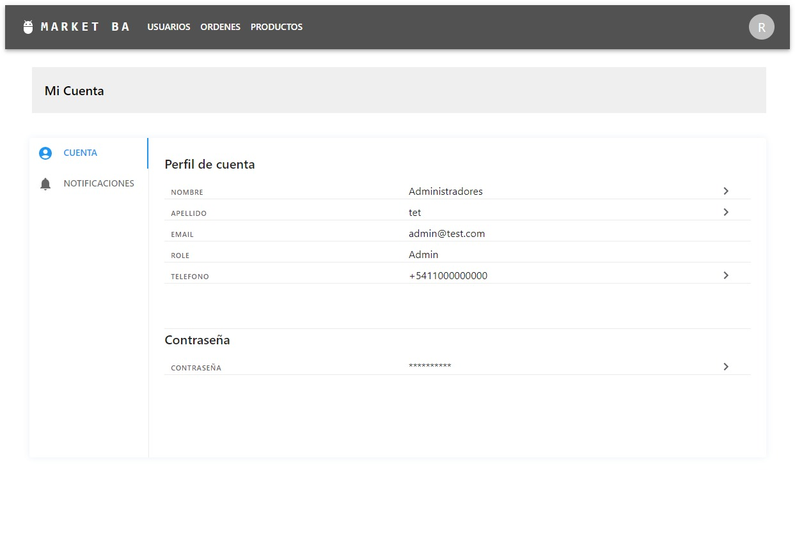
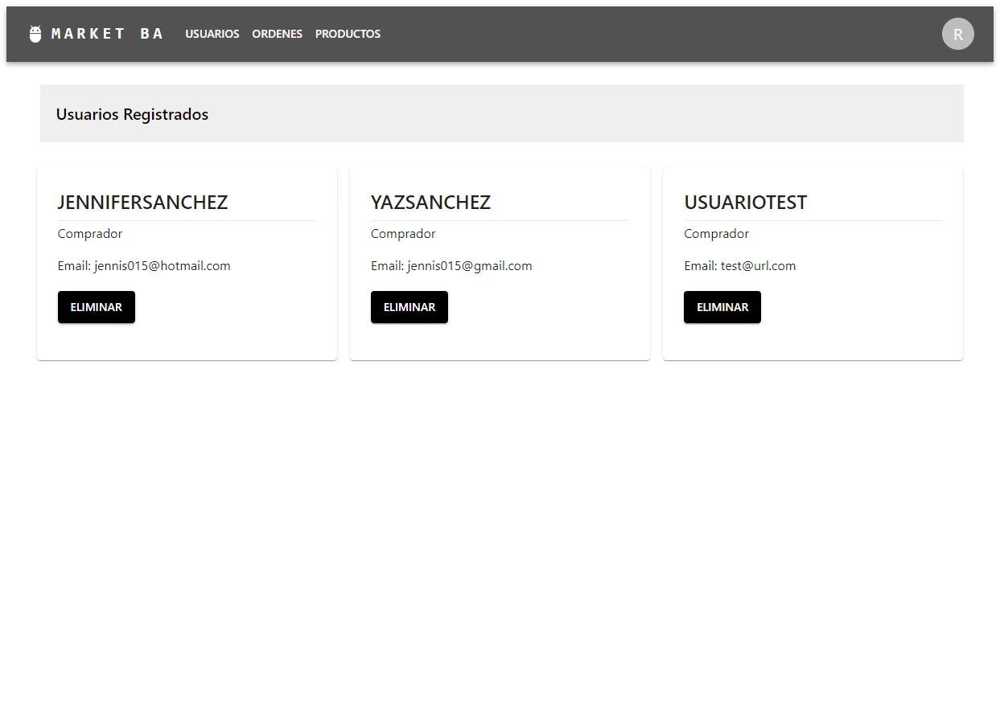

  # Front-End de sitio administrador de un ecommerce
 
--------------

## Inicio de Sesión
Cuenta con la parte del administrador con inicio de sesión seguro.

Se utilizó Passport + JWT + nodemailer en el backend.

 

## Tablero de control
Desde el cual puede acceder a visualizar, editar y eliminar los distintos componentes detallados.

## Productos
Se permite gestionar las categorias y productos.
Se pueden generar, editar y eliminar.

## Ordenes de pedido

Se permite editar y eliminar pedidos de usuario.

 
## Cuentas de usuario

Se permite editar datos del administrador y configurar las notificaciones.

 
